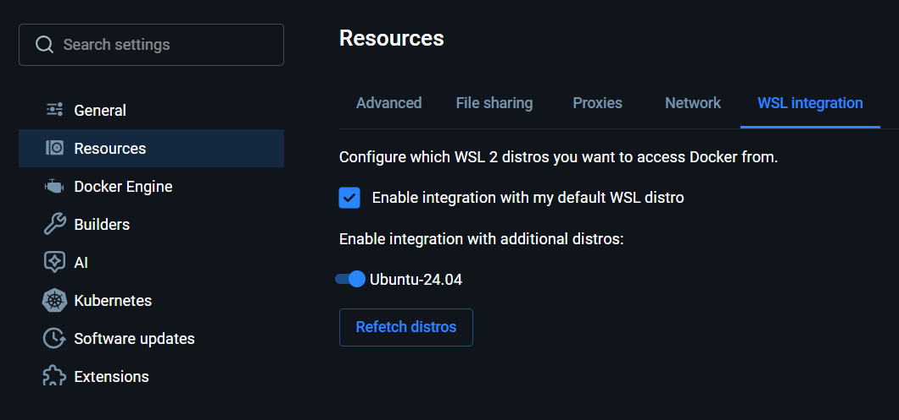

# Robot Map Poisoning Defense

ROS 2 + Webots simulation for studying decentralized defenses against robot-to-robot map poisoning.

The latest project direction is documented in:

- [docs/project_plan.md](docs/project_plan.md)
- [docs/file_structure.md](docs/file_structure.md)
- [docs/file_verification.md](docs/file_verification.md)
- [docs/equations.md](docs/equations.md)

## Current Project Focus

The current experiment plan compares three trust and confidence systems/methods:

```text
1. log_odds
2. mate_log_odds
3. mate_claim_verification
```

`log_odds` treats all robot reports as fully trusted. `mate_log_odds` uses MATE-style Bayesian robot trust with optional trust propagation, but still performs simple trust-weighted log-odds fusion. `mate_claim_verification` extends MATE with claim-level weights, occupied/free evidence layers, suspicious/disputed states, and quarantine.

The main research question is whether decentralized MATE-based trust-weighted map fusion can reduce the effects of map-poisoning attacks on navigation and final map accuracy.

The current shared-mapping baseline uses:

- per-robot live maps and confidence maps
- a MATE-style trust-weighted merged shared map per robot
- per-robot RViz windows for shared live maps and confidence overlays
- temporary fake obstacle injections that are meant to clear when real LiDAR evidence wins

The docs also describe the longer-term defense flow:

```text
robot report -> MATE robot trust -> trust confidence -> claim verification -> map-cell confidence -> navigation decision
```

## What You Need

Windows:

- Windows 11
- WSL2 with Ubuntu 24.04
- Docker Desktop with WSL integration enabled
- Webots R2025a installed on Windows
- Git inside WSL

macOS:

- macOS
- Docker Desktop
- Webots R2025a installed on macOS
- Git
- Python 3

ROS 2 runs in Docker, not on the host. The verification and quick-test scripts also expect `python3` on the host or inside WSL on Windows.

## First Time Setup

Before cloning:

- Install Docker Desktop.
- Install Webots R2025a.
- Install Git.
- On Windows, also install WSL2 with Ubuntu 24.04.
  - Then, inside Docker Desktop go to settings and enable WSL Integration

<p align="center"><strong>Windows Docker Settings</strong></p>



Then clone and run the following commands in the Linux terminal:

```bash
git clone git@github.com:natchuop/robot-map-poisoning-defense.git
cd robot-map-poisoning-defense
docker system prune -a --volumes -f
docker builder prune -a -f
docker compose -f docker/compose.yml build --no-cache
bash scripts/verify.sh
```

Make sure all checks from `verify.sh` pass.

If you prefer HTTPS, clone with your GitHub HTTPS URL instead.

## Final Testing After Setup

Once verification passes, run the main smoke test:

```bash
bash scripts/quick_test.sh
```

That launches Webots, ROS 2, RViz, and the AMCL/Nav2 checkpoint patrol demo together. You should have Webots open up automatically with a robot driving by itself along a predetermined route. A live RViz Window should also pop up and start recording everything that the robot's lidar sensor is sensing. Press `Ctrl-C` in the terminal (not Webots) to close everything.

Also try running this next script to make sure the latest additions are working properly.

```bash
bash scripts/runTestFakeObstacle.sh
```

This script should launch the same pop-ups as earlier, but there should be 2 different RViz windows (it might be hidden under the other window). These RViz windows should also be recording the locations/data sensed by both robots. You can use WASD and arrow keys to drive these around. Press `Ctrl-C` in the terminal (not Webots) to close everything.

Once you try out all of these commands, your setup should be complete.

## Other Scripts Found in the Repository

- Run verification: `bash scripts/verify.sh`
- Run the main smoke test: `bash scripts/quick_test.sh`
- Run the fake-obstacle shared-mapping demo: `bash scripts/runTestFakeObstacle.sh`
- Run the office demo: `bash scripts/runOffice.sh`
- Run the confusing maze demo: `bash scripts/runConfusingMaze.sh`
- Run the sandbox demo: `bash scripts/runSandbox.sh`
- Run the test-building demo: `bash scripts/runTestBuildingMapForRobot.sh`
- Run the RViz combination demo: `bash scripts/runTestCombineRvizMap.sh`
- Use the older mapping-only path only if you still want it: `RMPD_TEST_MODE=mapping bash scripts/quick_test.sh`

## Repository Map

- `docs/` holds the latest project plan, file structure guide, and verification guide.
- `scripts/` holds launch scripts, verification helpers, and demo runners.
- `src/` contains the ROS 2 packages, including `robot_patrol_msgs` and `robot_patrol_node`.
- `webots/` contains the Webots worlds, controllers, and map assets.
- `docker/` contains the Docker build and compose setup.

Generated folders such as `build/`, `install/`, and `log/` are safe to delete.

## Current ROS Pieces

The main package surface currently includes:

- `src/robot_patrol_msgs/msg/MapUpdate.msg`
- `src/robot_patrol_node/launch/multi_robot_mapping.launch.py`
- `src/robot_patrol_node/launch/fake_obstacle_injector.launch.py`
- `src/robot_patrol_node/launch/amcl_stack.launch.py`
- `src/robot_patrol_node/launch/nav2_stack.launch.py`
- `src/robot_patrol_node/launch/rviz.launch.py`

The active node set includes the Webots bridge, map builder, map merge, fake obstacle injector, confidence overlay, checkpoint patrol, pose helpers, and diagnostics nodes.

## Current Worlds

The repo currently includes these Webots worlds:

- `webots/worlds/office`
- `webots/worlds/confusingMaze`
- `webots/worlds/sandbox`
- `webots/worlds/testRvizMap`
- `webots/worlds/testBuildingMapForRobot`
- `webots/worlds/TestFakeObstacle`
- `webots/worlds/TestCombineRvizMap`

The docs define the main experiment maps as:

```text
office
single_hallway
two_path
```

with `small_maze` and `random_sandbox` as later optional stress tests.

## Notes

- `build/`, `install/`, and `log/` are generated and can be deleted safely.
- `testRvizMap`, `simpleCorridor`, and `twoRoute` use `webots/robot_controllers/patrol_robot/patrol_robot.py`, the Nav2-capable checkpoint patrol controller.
- `office`, `testBuildingMapForRobot`, `confusingMaze`, and `sandbox` use `webots/robot_controllers/user_controlled_robot/user_controlled_robot.py`.
- `runSimpleCorridor.sh` starts the simple corridor world at `(-5.25, 0.0, 0.0)` and loads `webots/worlds/simpleCorridor/amcl_map/simple_corridor.yaml`.
- `runTwoRoute.sh` starts the two-route world at `(-5.25, 0.0, 0.0)` and loads `webots/worlds/twoRoute/amcl_map/two_route.yaml`.
- `runOffice.sh` starts the office world at `(-4.35, -5.35, 0.00464)` and publishes that configured AMCL initial pose instead of assuming the robot starts at the origin.
- `runConfusingMaze.sh` starts the maze world at `(-3.5, -3.5, 0.0)` and generates `webots/worlds/confusingMaze/amcl_map/confusing_maze.yaml`.
- `runSandbox.sh` starts the sandbox world at `(2.0, 2.0, 0.0)` and generates `webots/worlds/sandbox/amcl_map/sandbox.yaml`.
- `runTestFakeObstacle.sh` starts `webots/worlds/TestFakeObstacle/TestFakeObstacle.wbt`, generates a static map from that world, and launches the two-robot shared-mapping stack with the fake-obstacle injector enabled.
- The Docker bridge listens on TCP and UDP port `5005`, publishes `/robot_pose`, `/scan`, and `/odom`, and forwards `/cmd_vel` plus checkpoint feedback topics between ROS and Webots.
- The docs' longer-term goal is to extend that bridge and map flow with MATE-style trust distributions, optional trust propagation, claim verification, map-cell confidence, and quarantine logic.
