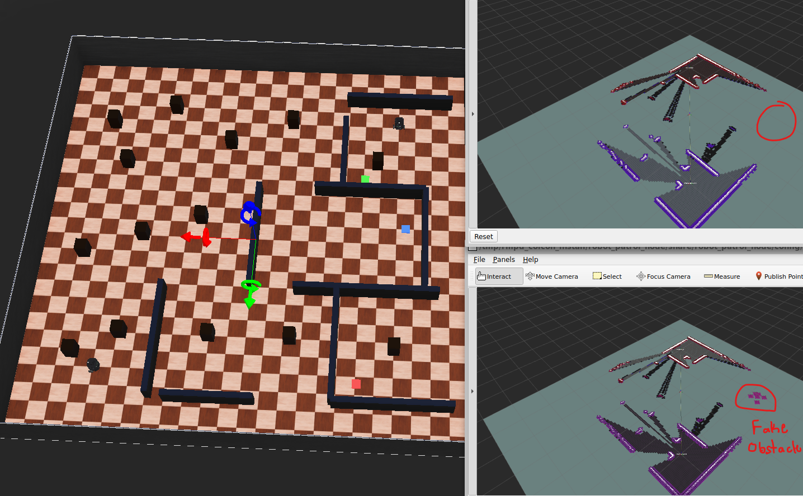
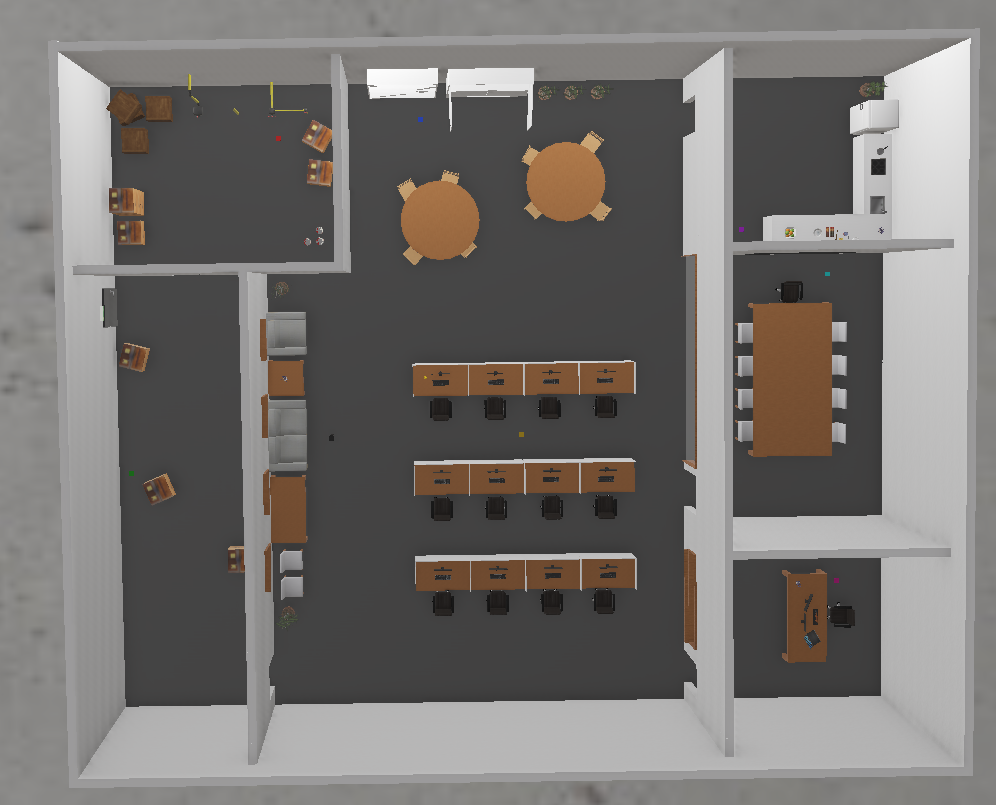
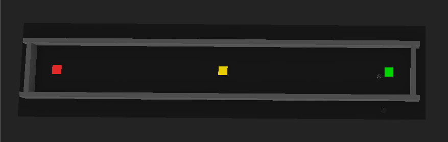
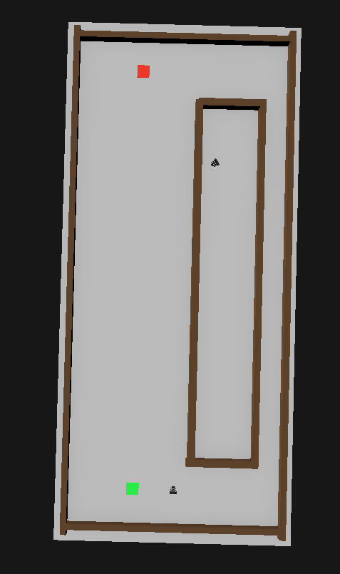

# Project Plan: Trust-Based Map Confidence for Robot-to-Robot Map Poisoning Defense

## 1. Project Goal

The goal of this project is to build and test a trust-based defense system for multi-robot mapping and navigation. The main claim guiding the project is: **Can decentralized trust-weighted map fusion reduce the effects of map-poisoning attacks on multi-robot navigation and final map accuracy?** In the simulation, multiple robots share map updates while moving through checkpoints in the same environment. One robot may become compromised and publish fake obstacle data, such as reporting that a hallway, doorway, or path is blocked when it is actually clear.

The system should not blindly accept shared map updates. Instead, each robot should decide how much influence another robot's map claim should have by combining robot trust, confidence in that trust, report quality, verification evidence, and map-cell confidence. The final goal is to reduce map poisoning while still allowing honest robots to share useful map information.

The main idea is:

```text
robot report -> robot trust -> trust confidence -> claim verification -> map-cell confidence -> navigation decision
```

This project focuses on decentralized trust. Each robot keeps its own trust records and map confidence values. No central server decides which robot is trustworthy. Trust is learned from physical verification and from verification receipts produced when robots later observe claimed map locations.

## 2. Research Question

Main research question:

```text
Can decentralized trust-weighted map fusion reduce the effects of map-poisoning attacks on multi-robot navigation and final map accuracy?
```

Simpler version:

```text
Can robots use trust and later LiDAR verification to decide whether shared obstacle reports are real, fake, or uncertain?
```

The project compares three map-fusion models. The comparison is designed to separate three questions:

1. What happens when robots trust all shared map updates equally?
2. Does a MATE-style robot trust baseline improve over no trust?
3. Does the proposed MATE-based claim-level verification method improve beyond robot-level MATE trust?

<p align="center"><strong>Simulation Demo</strong></p>



## 3. Models to Compare

### Model 1: Log-Odds Baseline with Full Trust

This is the standard occupancy-grid/log-odds baseline. It uses a normal map update and effectively gives every robot 100% trust.

Each cell stores a log-odds occupancy value:

```text
L_c(t) = log(P_c(t) / (1 - P_c(t)))
```

When a report says the cell is occupied:

```text
L_c(t+1) = L_c(t) + l_occ
```

When a report says the cell is free:

```text
L_c(t+1) = L_c(t) + l_free
```

Then the occupancy probability is recovered using:

```text
P_occ(c) = 1 / (1 + exp(-L_c))
```

In this model, robot identity does not affect the update. Practically, this means:

```text
T_ij(t) = 1.0 for every reporting robot j
```

This baseline represents what happens when a normal occupancy-grid navigation system accepts shared map updates without a map-poisoning defense.

### Model 2: MATE-Weighted Log-Odds Baseline

This is the upgraded trust baseline. It replaces the older simple Beta-reputation method with a MATE-style robot trust estimator, but it still uses ordinary trust-weighted log-odds map fusion.

Each observing robot `i` keeps a MATE-style trust PDF for each reporting robot `j`:

```text
tau_ij(t) ~ Beta(alpha_ij(t), beta_ij(t))
```

The robot trust mean is:

```text
T_ij(t) = alpha_ij(t) / (alpha_ij(t) + beta_ij(t))
```

This method uses optional MATE-style trust propagation:

```text
alpha_ij_minus(t) = (1 - omega) * alpha_ij(t-1) + omega * alpha0
beta_ij_minus(t)  = (1 - omega) * beta_ij(t-1)  + omega * beta0
```

Then verification receipts are converted into trust pseudomeasurements:

```text
rho_ijc(t) = (v_ijc(t), c_ijc(t))
```

where:

```text
v_ijc = 1.0 for confirmed claims
v_ijc = 0.0 for contradicted claims
c_ijc = confidence in that verification
```

The trust update is:

```text
alpha_ij(t) = alpha_ij_minus(t) + c_ijc(t) * v_ijc(t)
beta_ij(t)  = beta_ij_minus(t)  + omega_neg * c_ijc(t) * (1 - v_ijc(t))
```

where `omega_neg` can be greater than `1.0` so contradicted claims reduce trust faster than confirmed claims increase trust.

Map fusion remains simple:

```text
if robot j reports occupied:
    L_c = L_c + T_ij * l_occ

if robot j reports free:
    L_c = L_c + T_ij * l_free
```

This model tests whether MATE-style robot-level trust is enough to reduce fake obstacle acceptance. It intentionally does **not** include Method 3's trust-confidence multiplier, report quality multiplier, claim-specific verification confidence, caution ramp, suspicious/disputed states, quarantine, or claim-level evidence removal.

### Model 3: Proposed MATE-Based Claim Verification Defense

This is the proposed defense method. It keeps the MATE-style trust estimator from Model 2, then adds map-poisoning-specific claim-level reasoning.

The main idea is:

```text
MATE robot trust decides how reliable the source is.
Claim-level verification decides how much this specific cell claim should affect navigation right now.
```

For every report from robot `j` about cell `c`, compute:

```text
w_ijc(t) = T_ij(t) * C_ij(t) * Q_ijc(t) * R_ijc(t) * (1 - lambda_ij(t))
```

where:

```text
i = receiving or observing robot
j = reporting robot
c = grid cell being updated
T_ij(t) = MATE trust score
C_ij(t) = confidence in the MATE trust estimate
Q_ijc(t) = quality of this report about this cell
R_ijc(t) = verification confidence for this claim
lambda_ij(t) = caution factor for robots with limited verified history
w_ijc(t) = final influence of the report on the map cell
```

If any factor is low, the report has low influence on the shared map.

The proposed method stores two evidence values for each cell:

```text
O_c(t) = occupied evidence for cell c
F_c(t) = free evidence for cell c
```

If a report says the cell is occupied:

```text
O_c(t+1) = O_c(t) + w_ijc(t)
```

If a report says the cell is free:

```text
F_c(t+1) = F_c(t) + w_ijc(t)
```

Then the cell's occupancy score is:

```text
P_occ(c) = O_c / (O_c + F_c + epsilon)
```

The cell can be classified as:

| State | Meaning |
|---|---|
| Unknown | Not enough evidence yet |
| Occupied | Strong evidence of an obstacle |
| Clear | Strong evidence of free space |
| Suspicious | Weak or uncertain evidence |
| Disputed | Strong occupied and free evidence both exist |

Model 3 should make fake obstacle claims temporary and uncertain until physical verification supports them. If a later verification contradicts a claim, Method 3 can also remove or downgrade the specific evidence that claim added.

## 4. Trust, Confidence, and Verification

### MATE Robot Trust

Robot trust is represented as a MATE-style trust PDF, not only a binary count reputation score.

For observer robot `i` and reporter robot `j`:

```text
tau_ij(t) ~ Beta(alpha_ij(t), beta_ij(t))
```

The trust mean is:

```text
T_ij(t) = alpha_ij(t) / (alpha_ij(t) + beta_ij(t))
```

A new robot starts neutral:

```text
alpha0 = 1.0
beta0 = 1.0
T_ij(0) = 0.5
```

### Optional MATE-Style Trust Propagation

The project will use optional MATE-style trust propagation. Before new verification evidence is applied, trust can be pulled slightly toward the neutral prior:

```text
alpha_ij_minus(t) = (1 - omega) * alpha_ij(t-1) + omega * alpha0
beta_ij_minus(t)  = (1 - omega) * beta_ij(t-1)  + omega * beta0
```

Recommended starting range:

```text
omega = 0.001 to 0.01
```

This helps with late attackers because old correct behavior should not permanently dominate the trust score.

### Trust Pseudomeasurements

Verification results are converted into trust pseudomeasurements:

```text
rho_ijc(t) = (v_ijc(t), c_ijc(t))
```

where:

```text
v_ijc = trust evidence value in [0, 1]
c_ijc = confidence in the verification evidence in [0, 1]
```

For fake obstacle insertion:

```text
confirmed occupied claim -> v_ijc = 1.0
contradicted occupied claim -> v_ijc = 0.0
uncertain observation -> no trust update
```

Trust update:

```text
alpha_ij(t) = alpha_ij_minus(t) + c_ijc(t) * v_ijc(t)
beta_ij(t)  = beta_ij_minus(t)  + omega_neg * c_ijc(t) * (1 - v_ijc(t))
```

Use `omega_neg > 1.0` when negative evidence should count more strongly than positive evidence.

### Trust Confidence

Trust confidence estimates how much evidence supports the trust score. Use the MATE precision:

```text
nu_ij(t) = alpha_ij(t) + beta_ij(t)
nu0 = alpha0 + beta0
n_eff_ij(t) = max(0, nu_ij(t) - nu0)
```

Then:

```text
C_ij(t) = n_eff_ij(t) / (n_eff_ij(t) + k)
```

where:

```text
k = confidence growth parameter, suggested starting value 10
```

A robot with only a few verified claims should not become highly influential too quickly. Trust confidence is used in Method 3, not Method 2's map-fusion equation.

### Recent Trust and Late Attackers

A robot may behave honestly at first, but may get hijacked and start sending out attacks later. To handle this, Method 3 can use recent trust, lifetime trust, or a combined value.

```text
T_combined_ij(t) = min(T_life_ij(t), T_recent_ij(t))
```

Recent trust can be computed over the last `N` verified reports or last `M` seconds. This helps detect behavior changes.

### Caution Ramp

New or weakly verified robots should have limited influence in Method 3:

```text
lambda_ij(t) = c0 * exp(-gamma * n_eff_ij(t))
ramp_ij(t) = 1 - lambda_ij(t)
```

Suggested starting values:

```text
c0 = 0.9
gamma = 0.1
```

At the beginning, a robot has low influence. As verified history grows, its influence increases if its reports are correct.

### Report Quality

Report quality measures whether the robot could physically observe the claimed cell:

```text
Q_ijc(t) = Q_range_ijc(t) * Q_age_ijc(t) * Q_visibility_ijc(t) * Q_duplicate_ijc(t)
```

Possible terms:

- `Q_range`: nearby observations count more than far observations.
- `Q_age`: recent reports count more than stale reports.
- `Q_visibility`: visible LiDAR cells count more than occluded or out-of-range cells.
- `Q_duplicate`: repeated copies of the same report should not keep increasing evidence.

### Verification Confidence

Verification confidence measures whether the specific claim has been checked:

| Verification result | Example value |
|---|---:|
| Directly confirmed by LiDAR | 1.0 |
| Confirmed by another trusted robot | 0.8 |
| Consistent with verified map | 0.6 |
| New but unverified | 0.3 |
| Conflicts with trusted evidence | 0.0 to 0.2 |

The key idea is that long-term trust is updated by MATE pseudomeasurements, while Method 3's immediate map influence is controlled by claim-specific verification and report quality.

## 5. Verification Receipts

Instead of having robots simply accept, reject, or majority-vote on map data, each robot attaches a verification record to important map claims. For example, if Robot A reports that a corridor is blocked, other robots do not immediately treat that as permanent truth. They store it as a low-confidence claim and later challenge it through normal patrol behavior.

When Robot B or Robot C physically observes the claimed location, it publishes a verification receipt saying whether the claim was confirmed or contradicted. Over time, each robot builds a local record of which robots make claims that survive verification.

This keeps the system decentralized. Each robot independently updates trust based on receipts it receives and observations it makes itself. The project does not require a central trust authority.

A receipt should include:

```text
claim_id
reporting_robot_id
verifying_robot_id
cell_x
cell_y
original_claim_type
verification_result: confirmed, contradicted, or uncertain
verification_time
verifier_pose
optional scan_id
```

If cryptographic signatures are not implemented, these should be called verification receipts or verification records rather than signed receipts.

## 6. Quarantine

If the system has enough evidence that a robot is unreliable, the robot can be quarantined:

```text
quarantine_ij = true if T_combined_ij < theta_T and C_ij > theta_C
```

Suggested thresholds:

```text
theta_T = 0.25
theta_C = 0.70
```

A quarantined robot's reports are logged but do not affect the shared map or navigation costmap.

This rule uses both low trust and high trust confidence. A robot should not be quarantined after only one or two suspicious reports. It should be quarantined only when the system has enough evidence that it is unreliable.

## 7. Test Environments

The first version of the experiment should use three main maps:

1. **Office map**
   

  - Simulates a realistic indoor environment.
  - Useful for showing practical performance in a room-and-hallway layout.
2. **Single-hallway map**
   

  - Contains one main path through the environment.
  - A fake obstacle can fully block progress, making this a worst-case test.
3. **Two-path map**


  - Contains one short path and one longer alternate path.
  - A fake obstacle on the short path tests whether the robot takes an unnecessary detour.

A small maze map can be added later as an optional stress test. The maze is useful because it creates many route choices, but it may make results harder to interpret. The random sandbox map with scattered walls and objects can also be used later for robustness testing, but it should not be part of the first required comparison.

## 8. Attack Model

The first experiments should focus on fake obstacle injection.

In a fake obstacle attack, a compromised robot reports that a free cell is occupied. Example:

```json
{
  "reporting_robot_id": "robot_1",
  "cell_x": 10,
  "cell_y": 12,
  "reported_state": "OCCUPIED",
  "attack_type": "fake_obstacle"
}
```

The attack goal is to make other robots reroute, get stuck, delay checkpoint completion, or mark free space as blocked.

Fake clearing should be mentioned as future or secondary work. In a fake-clearing attack, the malicious robot reports a real occupied cell as free. This is important because it can cause collisions, but it adds complexity because the experiment must carefully place real obstacles and detect collisions or unsafe clearance. The first version can focus on fake obstacles and include fake clearing as a later extension.

## 9. Trial Design

Each trial should keep the robot route, map, attack location, start pose, checkpoint order, Nav2 settings, and random seed as consistent as possible across the three models.

Recommended first experiment:

```text
3 models x 3 maps x 3-5 trials per map/model
```

Models:

```text
1. log_odds
2. mate_log_odds
3. mate_claim_verification
```

Maps:

```text
1. office
2. single_hallway
3. two_path
```

Attack:

```text
fake obstacle injection on or near the planned route
```

Optional later expansion:

```text
small_maze map
fake clearing attack
noisy honest robot scenario
late attacker scenario
```

## 10. Main Metrics

The project should emphasize navigation behavior and final map accuracy, while still measuring trust and attack-defense behavior.


| Metric                                  | Purpose                                                                            |
| --------------------------------------- | ---------------------------------------------------------------------------------- |
| Final map accuracy                      | Measures how close the final shared map is to ground truth.                        |
| False occupied rate                     | Measures how often fake obstacles remain accepted as real.                         |
| Checkpoint success rate                 | Measures whether the robot completes its checkpoint route.                         |
| Checkpoint delay / time to finish route | Measures how much the attack slows navigation.                                     |
| Path length increase                    | Measures whether fake obstacles force unnecessary detours.                         |
| New route chosen / reroute behavior     | Measures whether the robot changes route because of poisoned data.                 |
| Time to remove poisoned data            | Measures how quickly fake obstacles are cleared, downgraded, or marked suspicious. |
| Attacker detection or quarantine delay  | Measures how long it takes for trust to drop or quarantine to trigger.             |
| False punishment rate                   | Measures whether honest or noisy robots are unfairly distrusted.                   |
| Runtime per update                      | Measures whether the defense is practical for real-time use.                       |

## 11. What to Log

For each map update, log:

```text
timestamp
trial_id
fusion_mode
map_name
robot_id
cell_x
cell_y
reported_state
ground_truth_state
is_attack_report
claim_id
```

For Model 2, also log:

```text
alpha_ij
beta_ij
T_ij
trust_precision
mate_prior_pull_omega
psm_value
psm_confidence
L_c_before
L_c_after
P_occ_after
```

For Model 3, also log:

```text
alpha_life_ij
beta_life_ij
alpha_recent_ij
beta_recent_ij
T_life_ij
T_recent_ij
T_combined_ij
trust_precision
n_eff_ij
C_ij
lambda_ij
ramp_ij
Q_range
Q_age
Q_visibility
Q_duplicate
Q_total
R_ijc
w_ijc
O_c_before
F_c_before
O_c_after
F_c_after
P_occ_after
cell_state_after
quarantine_status
claim_evidence_removed
```

For each navigation trial, log:

```text
fusion_mode
map_name
trial_id
random_seed
start_pose
checkpoint_route
attack_location
attack_start_time
checkpoint_success
route_completed
collision_detected
stuck_detected
time_to_finish_route
path_length_actual
path_length_clean_reference
path_length_increase_percent
reroute_taken
final_map_accuracy
final_false_occupied_rate
runtime_per_update
```

## 12. Implementation Plan

1. Add a configurable fusion mode:

```text
fusion_mode = log_odds
fusion_mode = mate_log_odds
fusion_mode = mate_claim_verification
```

1. Implement the standard log-odds occupancy update.
2. Implement MATE-style trust PDFs, pseudomeasurements, optional propagation, and MATE-weighted log-odds.
3. Implement the proposed trust-weighted evidence update.
4. Add claim IDs to shared map updates.
5. Store unverified obstacle claims as temporary or low-confidence.
6. Add verification receipts when another robot observes the claimed cell.
7. Update robot trust and trust confidence after confirmed or contradicted claims.
8. Classify cells as unknown, occupied, clear, suspicious, or disputed.
9. Convert the final map state into a Nav2-compatible costmap.
10. Run the same checkpoint route under each model.
11. Inject fake obstacles at fixed locations.
12. Log navigation, trust, map, and runtime metrics.
13. Compare results in tables and plots.

## 13. Expected Outcome

The standard log-odds model is expected to accept fake obstacle reports most easily because it does not know which robot sent the report or whether that robot is trustworthy.

The MATE-weighted log-odds model should reduce some poisoned updates because reports from low-trust robots have less influence. Optional MATE-style trust propagation and negative pseudomeasurement updates should help with late attackers. However, it may still be weak against new robots or already-inserted fake obstacles because it does not use claim-level evidence removal, suspicious/disputed states, or quarantine.

The proposed trust-weighted claim verification defense should perform best under fake obstacle injection because it uses robot trust, trust confidence, report quality, verification receipts, suspicious/disputed cell states, and quarantine. The expected result is higher final map accuracy, fewer fake obstacles accepted, less unnecessary rerouting, shorter checkpoint delay, faster removal of poisoned map data, and acceptable runtime overhead.